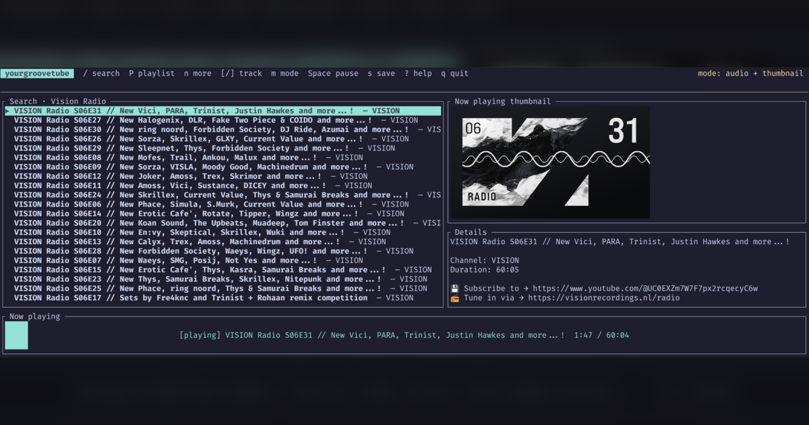

# yourgroovetube

A keyboard-driven terminal YouTube viewer built with Rust and
[Ratatui](https://ratatui.rs/).



> [!IMPORTANT]
> Search and metadata will use the official YouTube Data API wherever possible.
> Playback and downloads use mpv with a `yt-dlp`-compatible extractor and are
> **not** supported YouTube API features. They carry policy, content-rights, and
> maintenance risks. Read [the policy boundary](docs/youtube-api-and-policy.md).

## Vision

`yourgroovetube` is designed for fast keyboard discovery and playback:

- search video titles and tags;
- start from a regional popular-video feed (the official API does not expose
  personalized YouTube Home recommendations);
- toggle between normal video and audio with the thumbnail retained in the TUI;
- show elapsed time and progress while mpv plays; and
- explicitly save the current video into
  `/nas/video/Saved Youtube Videos` for Plex to discover.

## Current status

The repository contains a runnable application with live, official YouTube Data
API discovery, persistent mpv playback, terminal thumbnails, YouTube playlist
queues, and explicit Plex-library saving. Packaging and release polish remain.

The application already includes:

- a regional `mostPopular` default feed;
- explicit title/tag search with batched metadata hydration;
- five-minute in-memory result caching and explicit pagination;
- persistent mpv playback controlled through newline-delimited JSON IPC;
- yt-dlp-backed YouTube URL resolution, pause/resume, and video/audio switching;
- observed playback position, duration, end state, and IPC errors;
- automatic Kitty, iTerm2, Sixel, or Unicode half-block thumbnails;
- audio mode that keeps the current video's thumbnail visible while `vid=no`;
- search-result and public/unlisted playlist queues with pagination, automatic
  advancement, manual previous/next controls, and shuffle playback;
- an in-app saved-playlist library persisted in the platform configuration file;
- asynchronous, explicit yt-dlp saving into the configured Plex library;
- keyboard/search state and a responsive Ratatui layout;
- a live now-playing progress gauge;
- platform-standard configuration loading;
- `doctor` and `config path` commands; and
- tests plus GitHub Actions validation.

## Requirements

- Rust 1.90 or newer when building from source
- [`mpv`](https://mpv.io/) on `PATH`
- [`yt-dlp`](https://github.com/yt-dlp/yt-dlp) on `PATH`
- a YouTube Data API v3 key for discovery

## Install

Install the latest source revision with Cargo:

```console
cargo install --git https://github.com/feoh/yourgroovetube
```

To build from a local source checkout and install the resulting release binary:

```console
cargo install --path . --locked --force
```

This installs `yourgroovetube` to `~/.cargo/bin`; ensure that directory is on
`PATH`.

Tagged releases publish Linux x86-64, macOS Apple Silicon, and Windows x86-64
archives on the [GitHub Releases](https://github.com/feoh/yourgroovetube/releases)
page.

## Build and run

```console
git clone https://github.com/feoh/yourgroovetube.git
cd yourgroovetube
cargo run
```

Force portable Unicode half-block thumbnails when terminal image detection is
unwanted:

```console
cargo run -- --no-images
```

A [YouTube Data API v3 key](https://console.cloud.google.com/marketplace/product/google/youtube.googleapis.com)
is required. On the first interactive launch, `yourgroovetube` displays this
direct setup URL, prompts for the key with input hidden, validates it by
connecting to YouTube, and saves it to the platform configuration file. Leaving the prompt
blank or running without an interactive terminal and without a configured key
aborts startup instead of opening a non-functional interface.

Inspect prerequisites and the configuration path:

```console
cargo run -- doctor
cargo run -- config path
```

To provide the key without writing it to disk, set the environment variable
before launching:

```console
export YOURGROOVETUBE_YOUTUBE_API_KEY='your-key'
cargo run
```

Alternatively, create or edit the file printed by `yourgroovetube config path`:

```toml
[youtube]
api_key = "your-key"
region_code = "US"
results_per_page = 25
# Opt-in; unset means anonymous extraction, which YouTube may block.
# cookies_from_browser = "firefox"

[plex]
library_dir = "/nas/video/Saved Youtube Videos"

# These are normally added from the in-app playlist library.
[[playlists]]
name = "Focus music"
playlist_id = "PL1234567890"
```

Do not commit API keys, tokens, cookies, or captured YouTube responses.

### Optional cookie extraction

**Optional means opt-in, not that playback without cookies is guaranteed.**
By default, `yourgroovetube` does not request browser cookies. YouTube may reject
anonymous extraction on your connection every time, not just occasionally. This
surfaces as a `[stopped]` track and an `mpv:` error such as
`Sign in to confirm you're not a bot` in the status line.

Setting `youtube.cookies_from_browser` makes both playback and Plex saving reuse
an existing browser login, accepting the value format that
`yt-dlp --cookies-from-browser` documents
(`BROWSER[+KEYRING][:PROFILE][::CONTAINER]`), for example `firefox`,
`chrome:Profile 1`, or `vivaldi`. Cookies may help, but do not guarantee playback.

A successful standalone `yt-dlp --cookies-from-browser vivaldi ...` command reads
cookies for that invocation; it does **not** permanently log yt-dlp in or
configure `yourgroovetube`. To use the same cookies in the app:

1. Run `yourgroovetube config path` to locate the configuration file.
2. Add `cookies_from_browser = "vivaldi"` inside the **existing `[youtube]`
   section**, preserving your API key. Replace `vivaldi` with the exact
   browser/profile value from your successful command.
3. Restart the app. Run `yourgroovetube doctor` to confirm it reports
   `yt-dlp cookies: from browser vivaldi` rather than `none (anonymous extraction)`.

This is deliberately opt-in and unset by default:

- it attaches a real YouTube account to extractor traffic, which raises the
  policy risk described in [the policy boundary](docs/youtube-api-and-policy.md);
- `yt-dlp` reads the browser's cookie store directly, and YouTube may rotate or
  invalidate a session that is in use elsewhere, logging that browser out; and
- it requires a local browser profile, so it cannot work on a headless host.

A dedicated browser profile used only by `yourgroovetube` avoids disturbing a
primary login. Confirm the resolved setting with `yourgroovetube doctor`.

Name the profile explicitly when the login does not live in the browser's
default profile, because `yt-dlp` otherwise reads whichever profile
`profiles.ini` marks as default:

```toml
cookies_from_browser = "firefox:/home/you/.mozilla/firefox/ZK6htinr.Profile 1"
```

## Troubleshooting playback

A track that reports `[stopped]` means `mpv` could not resolve the video, not
that the file is broken. The status line names the underlying reason, which
`yourgroovetube` reads from mpv's error log over IPC; `mpv` itself reduces every
resolution failure to `unrecognized file format`. Reproduce it directly with:

```console
yt-dlp -v --simulate --print title -- 'https://www.youtube.com/watch?v=VIDEO_ID'
```

Current YouTube extraction needs a working JavaScript runtime to solve player
challenges, and both halves must be present:

1. **The runtime itself.** Only `deno` is enabled by default, so a machine with
   `node` instead needs `--js-runtimes node`. Putting that in
   `~/.config/yt-dlp/config` covers playback and Plex saving at once, since both
   go through `yt-dlp`. Without it, `yt-dlp` warns
   `No supported JavaScript runtime could be found`.
2. **The challenge solver scripts**, from the `yt-dlp-ejs` package
   (`uv tool install yt-dlp --with yt-dlp-ejs`). Without them, `yt-dlp` reports
   `n challenge solving failed` and then `No video formats found!`.

A `Sign in to confirm you're not a bot` error alone does not distinguish a
JavaScript challenge problem from YouTube rejecting anonymous access. Check the
extractor's diagnostics for runtime or challenge-solver warnings and address
those if present. If the same video works with `yt-dlp --cookies-from-browser`
but fails in the app, configure the same browser/profile as described in
[Optional cookie extraction](#optional-cookie-extraction); the app does not
inherit the options from your earlier command.

## Planned keybindings

| Key | Action |
| --- | --- |
| `/` | Open title/tag search (`Enter` submits, `Esc` cancels) |
| `j`/`k` or arrows | Select a video |
| `n` | Load the next result or playlist page |
| `P` | Open saved playlists (`a` add, `d` delete, `o` one-off URL/ID) |
| `[` / `]` | Play the previous/next queued video |
| `r` | Toggle shuffle for loaded search or playlist videos |
| `Enter` or `p` | Play the selected video |
| `m` | Toggle video / audio-with-thumbnail mode |
| `Space` | Pause or resume |
| `s` | Save the current video to the Plex directory |
| `?` | Show keyboard help |
| `q` | Quit |

Saved playlists are stored in the same platform-standard `config.toml` as the
other settings. Press `P`, then `a`, enter a display name, and paste the
playlist URL or ID once. Future sessions can open it directly from the `P`
library with `j`/`k` and `Enter`. Playlist names are unique without regard to
ASCII case, so adding the same name again updates it. Press `o` in the library
to load a playlist without saving it.

Shuffle applies to search-result or playlist videos currently loaded in the
TUI; it is not available on the default popular feed. It starts with the
selected video, visits every other loaded video once in randomized order, and
then stops. Use `n` to load additional search-result or playlist pages; pages
loaded while queued playback is active are appended without reordering tracks
already visited. A newly loaded page is randomized before appending when
shuffle is on and retains provider order when shuffle is off.

## Implementation ranking

| Stack | Runtime performance | Ease of implementation | Decision |
| --- | ---: | ---: | --- |
| Rust + Ratatui | 1 | 3 | **Selected** — best runtime/distribution and proven local patterns |
| Go + Bubble Tea | 2 | 2 | Good compromise, less reusable project code |
| Python + Textual | 3 | 1 | Fastest prototype, higher runtime and packaging overhead |

For this network/process-bound application, all three would be responsive. Rust
was selected for efficient long-running playback, a single distributable binary,
and direct control over mpv IPC and terminal image lifetimes.

See [the architecture](docs/architecture.md) for component boundaries and the
quota-conscious API plan.

## Development

```console
cargo fmt --all -- --check
cargo clippy --all-targets --all-features -- -D warnings
cargo test --all-targets --all-features
```

## License

MIT. See [LICENSE](LICENSE).
